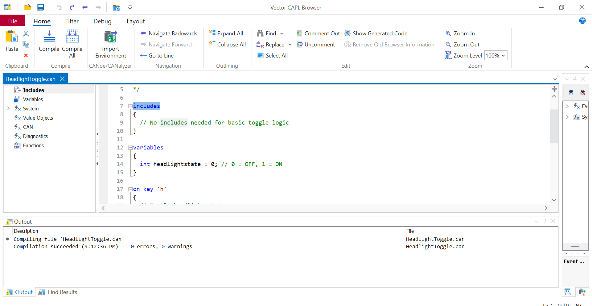

# CAPL Program 1: Toggle CAN Signal Using Keyboard Press

**File Name**: `HeadlightToggle.can`  
**Mode**: View-Only Mode (CANoe Pro)  
**Key Functionality**: Pressing the `h` key toggles the value of a CAN signal

---

## Objective

To demonstrate a **basic CAPL scripting skill** by toggling a simulated signal (`HeadlightStatus`) using a key press.
This is the first step in showcasing interaction between keyboard events and simulated CAN messages.

---

## Use Case (Real-World Relevance)

In real automotive systems, toggling a signal like **HeadlightStatus** is linked to user input (e.g., switch press). This script simulates that logic in a controlled test environment.

### Example Scenarios:
- Toggling headlights on/off for dashboard indicator testing
- Simulating **digital inputs** in hardware-in-the-loop (HIL) testing setups
- Validating **body control module** (BCM) logic using mock signals

---

## Script Summary

### Logic:
- `int headlightState = 0;` → initializes headlight to OFF
- `on key 'h'` → each key press toggles the state (`0 <-> 1`)
- The new value is printed to the **Write Window**

on key 'h'
{
  headlightState = !headlightState;
  write("HeadlightStatus toggled to: %d", headlightState);
}

## View-Only Mode Limitation

Since we are working in **CANoe View-Only mode**, signal assignment is disabled. Therefore:

1. Comfort::Console::Console_2::Light = headlightState is **commented out**, as it would generate an error.  
2. Signal toggle **won’t reflect on CAN Bus**, but is **logged via `write()`**.


## Screenshots

| Toggle Event Output | Compilation Status |
|---------------------|--------------------|
|  |  |

---

## Expected Output

On pressing `h` repeatedly:

```
HeadlightStatus toggled to: 1
HeadlightStatus toggled to: 0
HeadlightStatus toggled to: 1
...
```

Can be seen in the **Write Window**.

---

## Next Steps

This project can be extended with:
- Signal assignment using a **licensed CANoe version**
- Adding delay (`setTimer`) and logging toggle time
- Creating virtual dashboard panels to reflect signal state
- Integrating DBC signal selection via dropdown logic

---

**Parent Folder**: `Section11_Create_a_CAPL_program`  
This is part of a larger initiative to master automotive validation workflows using CANoe.